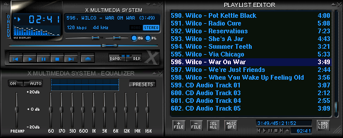

# XMMS GTK2

> A preservation fork of XMMS 1.2.11 for modern Linux systems.

> [!IMPORTANT]
> This project is **not actively maintained**. Issues and pull requests may not
> be reviewed. If you want to continue developing XMMS GTK2, please fork this
> repository and maintain your own open-source fork under the terms of the
> [GPL-2.0-or-later license](COPYING).




*The classic XMMS interface. Screenshot by
[ShadowDragon](https://en.wikipedia.org/wiki/User:ShadowDragon), licensed under
[GPL-2.0-or-later](docs/images/README.md), via
[Wikimedia Commons](https://commons.wikimedia.org/wiki/File:XMMS_(1).png).*

---

## About

XMMS (X Multimedia System) is a lightweight, skinnable audio player with a
plugin architecture for input, output, effect, general, and visualization
plugins. It supports MP3, Ogg Vorbis, WAV, module formats (MOD, XM, S3M, IT and
others via libmikmod), CD audio, and HTTP/Icecast/Shoutcast streaming.

XMMS GTK2 is based on the last upstream release, **XMMS 1.2.11**, and
currently uses the **GTK2 / GLib2** port of the original GTK1 codebase so that
it continues to compile and run on contemporary Linux distributions.
The `xmms` executable, source-package name, configuration paths, and plugin
interfaces retain their historical identifiers for compatibility.

---

## Project lineage and credits

This is **not** the original XMMS project. Upstream development ended with the
1.2.11 release in 2007, and the original `xmms.org` website is no longer
online. This fork received a compatibility and preservation update in 2026,
but it is no longer actively maintained.

Repository history falls into three periods:

1. The original XMMS authors and contributors developed XMMS from 1997 to 2007.
2. Oleg Pudeyev imported XMMS 1.2.11 into Git in 2015 and created the initial
   GTK2 / GLib2 port preserved in this repository's history.
3. Maintenance work in 2026 focused on compatibility and preservation alongside
   other independent XMMS forks and related projects.

The 2026 maintenance work included:

- Completing and hardening GTK2 compatibility while preserving classic UI
  behavior
- Fixing **GCC 15** build blockers and modern compiler warnings
- Defaulting audio output to **ALSA** on modern Linux (OSS as a legacy option)
- Fixing plugin discovery and ALSA playback and volume behavior
- Maintaining regression tests, source distributions, documentation, and
  GitHub project infrastructure

The goal is preservation and modernization: keeping a piece of desktop
multimedia history usable on today's systems.

**Original creators:**

- Peter Alm — main programming
- Håvard Kvålen — additional programming
- Thomas Nilsson — homepage, graphics, documentation & support
- Olle Hällnäs — documentation & support

Many additional contributors shaped XMMS over the years. The full credited
list is preserved in [CONTRIBUTORS.md](CONTRIBUTORS.md). See also the
[changelog](CHANGELOG.md) and git history for fuller attribution.

> ℹ️ The original `http://www.xmms.org` website, its bug tracker
> (`bugs.xmms.org`), and the historical `@xmms.org` contact addresses are no
> longer active. This repository is preserved as a historical and technical
> resource, not as an active support channel.

---

## Features

- Skinnable WinAmp 2.x-compatible interface (`.wsz`, zip, tar archives)
- Plugin system: Input, Output, Effect, General, Visualization
- Supported formats: MP1/2/3, Ogg Vorbis, WAV, MOD/XM/S3M/IT/… (via libmikmod), CD audio
- Streaming: HTTP, Icecast, Shoutcast (1.0/1.1) with title streaming
- Graphic equalizer with WinAmp EQF preset import/export
- Playlist editor with queue manager, jump-to-file, and sort options
- Visualization: blur scope, OpenGL spectrum analyzer, simple spectrum
- Doublesize, winshade, and dock-app (Window Maker / GNOME / AfterStep) modes

The complete feature list is in the [user manual](docs/manual.md#5-features).

---

## Installing a release package

The [GitHub Releases](https://github.com/tuunanet/xmms-gtk2/releases)
provide native x86-64 packages alongside the source archive:

- DEB packages target Ubuntu 24.04 LTS (`amd64`).

Download the runtime package and its `PACKAGES-SHA256SUMS` file from the
release, verify the checksum, then install it with the distribution package
manager:

```sh
# Ubuntu 24.04 LTS
sudo apt install ./xmms_1.2.12-1.ubuntu24.04_amd64.deb
```

The optional `libxmms-dev` DEB contains headers and linker files for plugin
development. Packages for other distributions should be built from source
rather than forced onto an incompatible system.

---

## Building from source

XMMS uses the GNU Autotools build system. This repository ships a pre-generated
`configure` script, so a from-tarball build is straightforward.

### Requirements

**Required:**

- A C compiler (GCC or Clang)
- `pkg-config`
- **GTK+ ≥ 2.0** and **GLib ≥ 2.0** (with `gthread`)
- POSIX threads (`pthread`)
- `zlib`

**Optional (enable additional plugins):**

- `libmikmod` ≥ 3.1.5 — module format support (MOD, XM, S3M, IT, …)
- `libvorbis` — Ogg Vorbis input plugin
- OpenGL (`libGL` or Mesa) — OpenGL spectrum analyzer visualization
- ALSA development headers — ALSA output plugin (recommended on Linux)
- ESD development headers — eSound output plugin (legacy)
- OSS / Sun audio — platform output plugins

### Build

```sh
./configure
make -j"$(nproc)"
make check
```

`make check` runs the regression suite. The file-browser tests require an X11
display; CI supplies one with Xvfb. To install system-wide (default prefix
`/usr/local`):

```sh
sudo make install
```

This installs the `xmms` binary to `<prefix>/bin` and plugins to
`<prefix>/lib/xmms/`.

On Ubuntu 24.04, after installing the Debian package build dependencies, build
and verify binary packages from the current source with:

```sh
make deb
```

The unsigned `xmms` and `libxmms-dev` packages are written to
`deb-artifacts/`. The target does not use `sudo` or install dependencies.

### Useful `configure` options

| Option | Description |
| --- | --- |
| `--prefix=PATH` | Installation prefix (default `/usr/local`) |
| `--disable-opengl` | Disable the OpenGL visualization plugin |
| `--disable-vorbis` | Disable the Ogg Vorbis input plugin |
| `--disable-mikmod` | Disable the MikMod input plugin |
| `--enable-one-plugin-dir` | Use a single plugin directory |
| `--disable-user-plugin-dir` | Disable per-user plugin directory |
| `--with-dev-dsp=PATH` | Path to OSS DSP device (default `/dev/dsp`) |
| `--with-dev-mixer=PATH` | Path to OSS mixer device (default `/dev/mixer`) |

Run `./configure --help` for the full list.

---

## Documentation

- **[User manual](docs/manual.md)** — the complete XMMS manual (controls,
  playlist editor, equalizer, preferences, and every bundled plugin),
  converted from the original `README`.
- **[Keyboard shortcuts](docs/manual.md#311-key-bindings)** — full key binding
  reference.
- **[Architecture](docs/architecture/README.md)** — UI, processing pipeline,
  plugins, external control, playlist/streaming, build/test, and skin format.
- **[CHANGELOG.md](CHANGELOG.md)** — curated release history for this fork.
- **[Release process](docs/releases.md)** — candidate builds, manual testing,
  version tags, and draft GitHub Releases.
- **[CONTRIBUTORS.md](CONTRIBUTORS.md)** — original project credits and later
  maintenance attribution.
- **[Upstream history](docs/history/README.md)** — archived release notes,
  detailed changelog, GTK1-era FAQ, and developer TODO list from 1997–2007.
- **[CONTRIBUTING.md](CONTRIBUTING.md)** — archived development workflow and
  technical guidance for downstream forks.
- **[CODE_OF_CONDUCT.md](CODE_OF_CONDUCT.md)** — participation and enforcement
  standards.
- **[SECURITY.md](SECURITY.md)** — supported versions and vulnerability
  reporting guidance.

---

## Related projects

These independent projects also preserve or reinterpret the classic XMMS and
Winamp experience using modern technologies. They are not affiliated with this
repository and have different compatibility goals.

- **[xubamp](https://github.com/hec-ovi/xubamp)** — a from-scratch Rust
  reimplementation of the classic Winamp 2.9x player for Ubuntu 26.04, using
  native Wayland and PipeWire while supporting classic `.wsz` skins.
- **[XMMS Resuscitated](https://gitlab.com/cschalle/xmms-resuscitated)** — a
  modern XMMS reimplementation built with GTK 4 and GStreamer, preserving
  Winamp 2.x skin compatibility and providing Flatpak releases.

---

## Continuing the project

This repository is not actively maintained and is not currently accepting
contributions through its issue and pull-request workflow.

If you want to continue the work, use GitHub's **Fork** action (or clone and
republish the repository), maintain your own open-source fork, and clearly
identify it as an independent project. The existing
[contribution guide](CONTRIBUTING.md) is retained as a reference for building,
testing, and developing the codebase.

---

## License

XMMS is free software licensed under the
**GNU General Public License version 2 or later** ([COPYING](COPYING)). It is
provided “as is,” without warranty of any kind.
